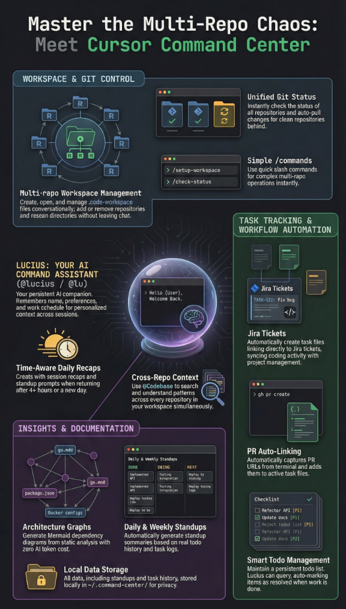

# Command Center

> **Multi-Repo Workspace Management for Cursor**

A Cursor plugin that brings order to multi-repo chaos. Workspace management, task tracking, PR linking, git status, architecture graphs, todo lists, standups, and daily recaps — all from chat.

**Meet Lucius** (`@lucius` or `@lu` for short) — your AI assistant who knows where everything is, how it all connects, and what needs doing next.

<p align="center">
  <a href="https://cursor.com/marketplace"></a>
  
</p>

<p align="center">

https://github.com/user-attachments/assets/ad786927-1b77-4bfc-8490-0ca37b224341

</p>

---

## What It Does

| Feature | Description |
|---------|-------------|
| **Workspace Management** | Create and manage multi-repo `.code-workspace` files from chat |
| **Task Tracking** | Auto-creates task files with optional Jira ticket linking |
| **PR Auto-Linking** | Captures PR URLs from `gh pr create` and adds them to task files |
| **Git Status** | Check status across all repos, auto-pull clean repos that are behind |
| **Architecture Graphs** | Visualize service dependencies from code — zero AI tokens |
| **Todo List** | Persistent todos across workspaces with priorities and smart queries |
| **Standups** | Daily and weekly standup summaries from todos and task history |
| **Daily Recap** | Time-aware greetings, session recaps, and standup prompts |
| **Personalization** | Remembers your name, preferences, and work schedule across sessions |
| **Export/Import** | Backup and restore everything — workspaces, todos, profile, history |
| **Cross-Repo Context** | `@Codebase` searches all repos in your workspace at once |

<p align="center">
  
</p>

---

## Quick Start

1. **Install the plugin** from the [Cursor Marketplace](https://cursor.com/marketplace)
2. **Type `@lucius help`** to see everything available (or `@lu` for short)
3. **Follow the intro** — Lucius will ask your name and remember it
4. **Type `@lucius setup a new workspace`** and follow the guided setup
5. **Start working** — task tracking, PR linking, and todo management happen automatically

---

## Meet Lucius

Lucius is your Command Center AI assistant. Type `@lucius` or `@lu` in chat and talk naturally:

```
@lucius set up a new workspace called backend with repos from ~/Projects
@lu check git status across all my repos
@lucius generate an architecture graph for the backend workspace
@lu what's next on my todo list?
@lucius add "fix auth bug" to my todos as high priority
@lu mark the auth task as done
@lu add server and api-gateway to my platform workspace
@lucius export my config for backup
@lu what PRs are open for this task?
@lucius what's left to do?
@lu have I forgotten something?
@lu standup
@lucius weekly recap
```

Lucius remembers your name and work schedule, greets you based on time of day, recaps what you were working on, and offers standup summaries at the start of each day or week.

---

## Features

### Workspace Management

Create, open, and manage multi-repo `.code-workspace` files. Add or remove repos, rename workspaces, rescan directories, and regenerate workspace files — all conversationally.

### Todo List

A persistent todo list that lives across sessions and workspaces:

- **Two sources**: Todos you add (`#user`) and todos Lucius detects (`#lucius`)
- **Smart queries**: "What's next?", "What's left?", "Have I forgotten something?"
- **Auto-completion**: Lucius auto-marks his own detected todos when resolved
- **Priorities**: High, medium, low with smart ordering
- **Cross-workspace**: All todos in one place, tagged by workspace

### Task Tracking & PR Linking

- Auto-creates task files in `task-history/[workspace]/` when you start working
- Jira ticket linking is optional — skip it and add later if discovered
- PRs are automatically captured from `gh pr create` and `git push` output
- Task files track PRs across multiple repos with status

### Architecture Graphs

Generate Mermaid dependency diagrams by analyzing `go.mod`, `package.json`, Terraform, Docker Compose, and serverless configs. Zero AI tokens — pure static analysis.

### Git Status

Check status across all repos in a workspace. See which repos are behind, have uncommitted changes, or need attention. Auto-pull repos that are clean and behind.

### Daily Recap & Standups

When you return after 4+ hours:

```
Good morning, Lionel. Here's where you left off:

Last session: backend workspace, worked on auth service refactor
Open todos: 3 pending, 1 in progress
Next up: Fix retry logic in API gateway (high priority)

Want to continue where you left off, or start something new?
```

On new days, Lucius offers to generate a standup summary. On the first day of your work week, he offers a weekly recap instead. Standups pull from your todos, task history, and previous standups to build a done/doing/next format — saved to `~/.command-center/standups/`.

Your work week is configurable (Mon–Fri or Sun–Thu) and stored in your profile.

### Export / Import

Backup and restore everything — workspaces, repo lists, todos, profile, task history, and docs. Supports path remapping for switching machines.

---

## Commands & Skills

### Commands (type `/` in chat)

| Command | What it does |
|---------|-------------|
| `/help` | Show all capabilities |
| `/setup-workspace` | Create a new multi-repo workspace |
| `/check-status` | Git status across all repos |
| `/todos` | Show and manage your todo list |
| `/standup` | Generate a daily or weekly standup summary |

### Skills (Lucius uses these automatically)

| Skill | What it does |
|-------|-------------|
| `workspace-manager` | Create, open, add/remove repos from workspaces |
| `graph-generator` | Generate architecture dependency diagrams |
| `repo-status` | Check git status, auto-pull clean repos |
| `todo-manager` | Persistent todo list with priorities and queries |
| `export-import` | Backup and restore configurations |
| `standup-generator` | Daily/weekly standup summaries from todos and task history |

### Always-On Rules

| Rule | What it does |
|------|-------------|
| Task tracking | Creates task files with optional Jira integration |
| PR linking | Captures PR URLs and adds them to task files |
| Personalization | Remembers your name and preferences |
| Daily recap | Time-aware greetings, session recaps, and standup prompts |

### Contextual Rules

| Rule | When it applies |
|------|----------------|
| Naming conventions | When working with `.code-workspace` files |

### Hooks (automatic)

| Hook | What it does |
|------|-------------|
| Session start | Detects workspace, loads profile, checks idle time, counts todos, detects new day/week |
| After shell execution | Captures PR URLs from git commands |
| Session end | Saves session state for next recap |

---

## @Codebase Tips

| Use `@Codebase` for | Skip `@Codebase` for |
|---------------------|---------------------|
| Finding code across repos | Working in a single file |
| Understanding patterns | General questions |
| Cross-repo search | After you've found the code |
| Architecture questions | Simple edits |

**Rule of thumb:** Use `@Codebase` to **find**, then regular chat to **modify**.

---

## Data Location

All Command Center data lives in `~/.command-center/`:

| Path | Contents |
|------|----------|
| `workspaces/` | `.code-workspace` files |
| `contexts/` | Repo lists per workspace |
| `task-history/` | Work logs organized by workspace |
| `docs/` | Reference guides organized by workspace |
| `standups/` | Daily and weekly standup summaries |
| `todos.md` | Persistent todo list across all workspaces |
| `profile.json` | Your name and preferences |
| `session-state.json` | Last session timestamp for recap detection |

---

## Plugin Structure

```
command-center/
├── rules/                    # Always-on AI guidance
│   ├── task-tracking.mdc     # Jira integration, task files
│   ├── pr-linking.mdc        # PR URL capture
│   ├── naming-conventions.mdc
│   ├── personalization.mdc   # Name, preferences, work schedule
│   ├── daily-recap.mdc       # Greetings, recaps & standup prompts
│   └── easter-egg.mdc        # The Fox Protocol
├── skills/                   # Agent capabilities
│   ├── workspace-manager/    # Create/manage workspaces
│   ├── graph-generator/      # Architecture visualization
│   ├── repo-status/          # Git status + auto-pull
│   ├── todo-manager/         # Persistent todo list
│   ├── standup-generator/    # Daily/weekly standup summaries
│   └── export-import/        # Backup/restore
├── agents/                   # Meet Lucius
│   ├── lucius.md             # Main agent — @lucius
│   └── lu.md                 # Quick alias — @lu
├── commands/                 # Chat commands (/command-name)
│   ├── help.md
│   ├── setup-workspace.md
│   ├── check-status.md
│   ├── todos.md
│   └── standup.md            # Daily/weekly standups
├── assets/                   # Static assets
│   ├── logo.svg              # Plugin logo
│   ├── overview.png          # Feature overview screenshot
│   └── easter-egg-art.md     # ASCII art for The Fox Protocol
├── hooks/                    # Event automation
│   └── hooks.json
└── scripts/                  # Hook implementations
    ├── session-start.sh
    ├── session-end.sh
    └── after-shell-execution.sh
```

---

## Also Available

For a standalone CLI version with interactive terminal menus, see [cursor-command-center](https://github.com/lionelresnik/cursor-command-center).

---

## Feedback & Issues

Found a bug or have a feature request?

- **GitHub Issues:** [Open an issue](https://github.com/lionelresnik/cursor-command-center-plugin/issues)
- **Email:** lionel.resnik@outlook.com

---

## Author

**Lionel M. Resnik**

[](https://github.com/lionelresnik)
[](https://www.linkedin.com/in/lionel-resnik/)

---

## License

[MIT License](LICENSE) — Use it, share it, improve it!

---

<p align="center">
  <sub>Made for developers who juggle many repos — meet Lucius, your command center AI</sub>
</p>
