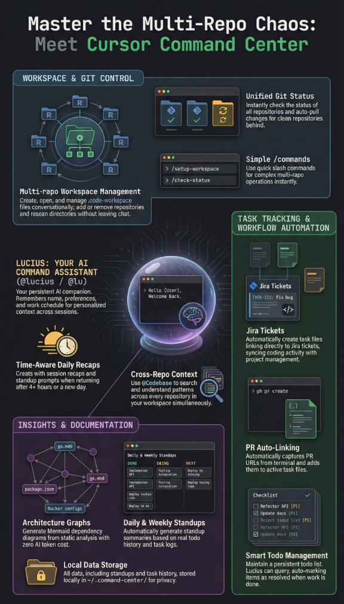

# Command Center

> **Multi-Repo Workspace Management for Cursor**

A Cursor plugin that brings order to multi-repo chaos. Workspace management, task tracking, PR linking, git status, architecture graphs, todo lists, standups, workspace knowledge base, **missions & crews**, and a static dashboard — all from chat.

**Meet Lucius** (`@lucius` or `@lu` for short) — your AI assistant who knows where everything is, how it all connects, and what needs doing next.

<p align="center">
  
  
  
</p>

<p align="center">

https://github.com/user-attachments/assets/ad786927-1b77-4bfc-8490-0ca37b224341

</p>

---

## What's New in v0.3.0

- **Deterministic todo store** — `cc todo` CLI + `todos.json` source of truth; `todos.md` is now a generated view. Faster, token-cheap, no dropped items. Existing `todos.md` auto-migrates.
- **~80% fewer always-on rule tokens** — heavy lifecycle rules are now trigger-scoped, with a thin `session-lifecycle` dispatcher keeping greeting/logging intact.
- **18 new tests** for the todo store.

## What's New in v0.2.3

- **`capture_pr_url`** now appends to a JSON list — multiple PRs per session preserved
- **`detect_workspace`** logs a warning when a repo path matches multiple workspaces
- **14 tests** added for `cc_session.py` (`tests/test_cc_session.py`)
- **CONTRIBUTING.md** added
- Easter egg moved into `lucius.md` (frees a rule slot; behaviour unchanged)

## What's New in v0.2.2

- **Install script** auto-resets dirty plugin clones on update (local edits in the install folder only)
- **README** troubleshooting for blocked `git pull` during updates
- Script executable bits fixed for `cc_session.py`, `cc_lock.py`, `install-mission-tools.sh`

## What's New in v0.2.1

- **Hardened session hooks** — Python JSON parsing; context files moved to `~/.command-center/` (no project git leaks)
- **Missions opt-in at session start** — no dashboard regen or mission scan until roles are seeded
- **Prerequisites** documented; **CHANGELOG.md** added

See [CHANGELOG.md](CHANGELOG.md) for full history.

## What's New in v0.2.0

This release merges the open feature branches into `main`:

| Merged work | Highlights |
|-------------|------------|
| **Audit & token reduction** (#3) | Leaner `@lu` usage guidance, consolidated rules, improved session-start context |
| **Daily log** (#2) | Real-time work logging integrated with standups |
| **Docs & markdown style** (#1) | Confluence-style doc templates, graph delegation, CLI migration skill |
| **Missions & crews** (new) | Multi-role missions, manual handoffs, behavior modes, static dashboard |

**New capabilities:**
- **Workspace knowledge base** — infra, databases, logs, services, runbooks under `docs/[workspace]/`
- **`@lu onboard`** — gap report for what's documented vs missing
- **Missions** — `@lu init missions`, `@lu new mission`, `@lu next role`, `@lu complete role`
- **Static dashboard** — `@lu dashboard` → open `~/.command-center/dashboard/index.html` in Simple Browser
- **Migrate from CLI** — `@lu migrate from CLI` preserves all `~/.command-center/` data
- **Preview dashboard** — open `assets/dashboard-preview.html` in Simple Browser to see the UI with mock data

---

## What It Does

| Feature | Description |
|---------|-------------|
| **Workspace Management** | Create and manage multi-repo `.code-workspace` files from chat |
| **Task Tracking** | Auto-creates task files with optional Jira ticket linking |
| **PR Auto-Linking** | Captures PR URLs from `gh pr create` and adds them to task files |
| **Git Status** | Check status across all repos, auto-pull clean repos that are behind |
| **Architecture Graphs** | Visualize service dependencies from code — zero AI tokens |
| **Todo List** | Persistent todos across workspaces with priorities and smart queries |
| **Standups** | Daily and weekly standup summaries from todos and task history |
| **Daily Recap** | Time-aware greetings, session recaps, and standup prompts after idle |
| **Daily Log** | Session work log integrated with standups and recaps |
| **Knowledge Base** | Workspace docs — infra, databases, logs, services, runbooks |
| **Onboarding** | Gap report for undocumented workspace knowledge (`@lu onboard`) |
| **Personalization** | Remembers your name, preferences, and work schedule across sessions |
| **Export/Import** | Backup and restore workspaces, todos, docs, missions, roles, crews |
| **Missions & Crews** | Multi-role missions, manual handoffs, agent behavior modes, artifacts |
| **Static Dashboard** | Visual mission board — no server (`@lu dashboard`) |
| **CLI Migration** | Move from [cursor-command-center](https://github.com/lionelresnik/cursor-command-center) CLI without losing data |
| **Cross-Repo Context** | `@Codebase` searches all repos in your workspace at once |

<p align="center">
  
</p>

---

## Prerequisites

| Tool | Required | Used for |
|------|----------|----------|
| **Cursor** | Yes | Plugin host |
| **git** | Yes | Workspace repos, status, PR workflow |
| **python3** | Yes | Session hooks, dashboard generator, file locks |
| **gh** | Recommended | PR creation/linking (`gh pr create`) |
| **jq** | Optional | Not required — hooks use Python for JSON |

---

## Install (manual — not on Marketplace yet)

Cursor loads local plugins from **`~/.cursor/plugins/local/<name>/`**. The plugin `name` is **`command-center`** (see `.cursor-plugin/plugin.json`).

### Easiest: install script

```bash
curl -fsSL https://raw.githubusercontent.com/lionelresnik/cursor-command-center-plugin/main/scripts/install-plugin.sh | bash
```

Or from a clone:

```bash
git clone https://github.com/lionelresnik/cursor-command-center-plugin.git
cd cursor-command-center-plugin
./scripts/install-plugin.sh
```

### Manual (same result)

```bash
git clone https://github.com/lionelresnik/cursor-command-center-plugin.git \
  ~/.cursor/plugins/local/command-center
chmod +x ~/.cursor/plugins/local/command-center/scripts/*.sh
chmod +x ~/.cursor/plugins/local/command-center/scripts/cc_session.py \
         ~/.cursor/plugins/local/command-center/scripts/cc_lock.py
~/.cursor/plugins/local/command-center/scripts/install-mission-tools.sh
```

### After install

1. **Reload Cursor** — `Cmd+Shift+P` → **Developer: Reload Window**
2. **Enable plugin** — **Cursor Settings → Plugins** → enable **command-center**
3. **Verify** — type `@lucius help` in chat

The install script automatically seeds **roles, crews, and dashboard tools** into `~/.command-center/` (idempotent — skips files you already have).

**Optional:** `@lu init demo missions` for sample missions on the dashboard; `@lu remove demo missions` to clean them up.

Your data (`~/.command-center/`) is separate from the plugin — updates do not touch todos, task history, or docs.

### Update to latest `main`

```bash
~/.cursor/plugins/local/command-center/scripts/install-plugin.sh
# or: git -C ~/.cursor/plugins/local/command-center pull
```

Then **Reload Window** again.

### Troubleshooting: `git pull` blocked by local changes

If an old install has edited or untracked files, `git pull` may abort. Your **`~/.command-center/` data is safe** — only the plugin copy under `~/.cursor/plugins/local/command-center/` is affected.

**Fix (recommended):** re-run the install script — it resets a dirty clone automatically:

```bash
~/.cursor/plugins/local/command-center/scripts/install-plugin.sh
```

**Or manually:**

```bash
cd ~/.cursor/plugins/local/command-center
git fetch origin
git reset --hard origin/main
git clean -fd
chmod +x scripts/*.sh scripts/cc_session.py scripts/cc_lock.py
./scripts/install-mission-tools.sh
```

Then **Reload Window**.

### Dev: symlink from your clone

If you hack on the repo locally:

```bash
rm -rf ~/.cursor/plugins/local/command-center
ln -s ~/Projects/cursor-command-center-plugin ~/.cursor/plugins/local/command-center
```

Reload Cursor after each change to rules/skills/agents.

---

## Quick Start

1. **Install the plugin** — see [Install](#install-manual--not-on-marketplace-yet) above (seeds roles, crews, dashboard tools automatically)
2. **Type `@lucius help`** to see everything available (or `@lu` for short)
3. **Follow the intro** — Lucius will ask your name and remember it
4. **Type `@lucius setup a new workspace`** and follow the guided setup
5. **Optional:** `@lu init demo missions` — sample missions for the dashboard
6. **Start working** — task tracking, PR linking, and todo management happen automatically

---

## Meet Lucius

Lucius is your Command Center AI assistant. Type `@lucius` or `@lu` in chat and talk naturally:

```
@lucius set up a new workspace called backend with repos from ~/Projects
@lu check git status across all my repos
@lucius generate an architecture graph for the backend workspace
@lu what's next on my todo list?
@lucius add "fix auth bug" to my todos as high priority
@lu mark the auth task as done
@lu add server and api-gateway to my platform workspace
@lucius export my config for backup
@lu what PRs are open for this task?
@lucius what's left to do?
@lu have I forgotten something?
@lu standup
@lucius weekly recap
@lu init missions
@lu init demo missions
@lu remove demo missions
@lu new mission "Fix auth bug" crew:backend-crew
@lu next role
@lu dashboard
@lu onboard
@lu migrate from CLI
```

Lucius remembers your name and work schedule, greets you based on time of day, recaps what you were working on, and offers standup summaries at the start of each day or week.

---

## Features

### Workspace Management

Create, open, and manage multi-repo `.code-workspace` files. Add or remove repos, rename workspaces, rescan directories, and regenerate workspace files — all conversationally.

### Todo List

A persistent todo list that lives across sessions and workspaces:

- **Two sources**: Todos you add (`#user`) and todos Lucius detects (`#lucius`)
- **Smart queries**: "What's next?", "What's left?", "Have I forgotten something?"
- **Auto-completion**: Lucius auto-marks his own detected todos when resolved
- **Priorities**: High, medium, low with smart ordering
- **Cross-workspace**: All todos in one place, tagged by workspace

### Task Tracking & PR Linking

- Auto-creates task files in `task-history/[workspace]/` when you start working
- Jira ticket linking is optional — skip it and add later if discovered
- PRs are automatically captured from `gh pr create` and `git push` output
- Task files track PRs across multiple repos with status

### Architecture Graphs

Generate Mermaid dependency diagrams by analyzing `go.mod`, `package.json`, Terraform, Docker Compose, and serverless configs. Zero AI tokens — pure static analysis.

### Git Status

Check status across all repos in a workspace. See which repos are behind, have uncommitted changes, or need attention. Auto-pull repos that are clean and behind.

### Daily Recap & Standups

When you return after 4+ hours:

```
Good morning, Lionel. Here's where you left off:

Last session: backend workspace, worked on auth service refactor
Open todos: 3 pending, 1 in progress
Next up: Fix retry logic in API gateway (high priority)

Want to continue where you left off, or start something new?
```

On new days, Lucius offers to generate a standup summary. On the first day of your work week, he offers a weekly recap instead. Standups pull from your todos, task history, and previous standups to build a done/doing/next format — saved to `~/.command-center/standups/`.

Your work week is configurable (Mon–Fri or Sun–Thu) and stored in your profile.

### Workspace Knowledge Base

Structured docs under `~/.command-center/docs/[workspace]/`:

- **Infrastructure** — cloud resources, networking, environments
- **Databases** — connections, schemas, ownership
- **Logs & monitoring** — where to find logs, dashboards
- **Services** — architecture overviews per service
- **Runbooks** — operational procedures

Findings from tasks are captured automatically (`auto-doc-updates`, `infrastructure-knowledge`). Use **`@lu onboard`** for a gap report of what's documented vs missing.

### Missions & Crews

Optional multi-role workflows for work that spans sessions (implement → review → document):

1. **Install the plugin** — roles/crews/dashboard tools are seeded automatically (or run `@lu init missions` to repair)
2. **`@lu init demo missions`** — optional sample missions for the board
3. **`@lu new mission "…" crew:backend-crew behavior:ask_me`** — create a mission
4. **`@lu next role`** — get the role prompt bundle (then use the **regular agent** for coding)
5. **`@lu complete role`** — save artifact; mission pauses for review (default)
6. **`@lu dashboard`** — regenerate and open the static board in Simple Browser

Remove sample data anytime: **`@lu remove demo missions`** (keeps roles, crews, and your real missions).

**Agent behavior modes** (per mission):

| Mode | Behavior |
|------|----------|
| `assume_and_document` | Continue; prefix guesses with `ASSUMPTION:` |
| `ask_me` | Up to 3 blocking `QUESTION:` lines — waits for you |
| `async` | Log `ASYNC_QUESTION:` at end; keeps going |

**Ad-hoc work** still uses `task-history/` — missions are optional.

#### Plan mode and missions

Plain Cursor Plan mode hands off via **Build** on the plan markdown (`.cursor/plans/`). CC missions are **file-based** — they do not auto-read Plan mode output or chat context.

| Step | What to do |
|------|------------|
| After Plan mode | Save decisions to the **task file** (`Analysis`, `Key Decisions`) — Lucius offers this when exiting Plan mode |
| Create mission | `@lu new mission "…" crew:backend-crew ticket:AUTH-123` — links via `ticket` + `missionId` in task frontmatter |
| Start work | `@lu next role` — role prompt should include linked task file sections (not full chat history) |

If the plan never reached the task file, the mission only gets the one-line `goal` unless you use `@lu checkpoint` or save the plan first. For simple fixes, use Cursor **Build** directly; use missions when you want crew handoffs across sessions.

Plan-first with crews: run a planning step into the task file (or a prior mission artifact), then start a backend crew mission that reads that file.

### Export / Import

Backup and restore workspaces, repo lists, todos, profile, task history, docs, standups, **roles, crews, and missions**. Export format v2.0. Supports path remapping when switching machines.

### Token Efficiency

`@lu` loads workspace context — great for standups, todos, missions, and cross-repo questions. For **pure coding** (debugging, reviews, refactors), use the **regular agent** to save tokens. See `rules/when-to-use-lu.mdc`.

### Migrating from the CLI

If you used the [cursor-command-center](https://github.com/lionelresnik/cursor-command-center) CLI, say **`@lu migrate from CLI`**. The plugin reads the same `~/.command-center/` directory — no data migration needed.

---

## Commands & Skills

### Commands (type `/` in chat)

| Command | What it does |
|---------|-------------|
| `/help` | Show all capabilities |
| `/setup-workspace` | Create a new multi-repo workspace |
| `/check-status` | Git status across all repos |
| `/todos` | Show and manage your todo list |
| `/standup` | Generate a daily or weekly standup summary |
| `/mission` | Mission status, crews, and next-role guidance |
| `/dashboard` | Regenerate static mission board |

### Skills (Lucius uses these automatically)

| Skill | What it does |
|-------|-------------|
| `workspace-manager` | Create, open, add/remove repos from workspaces |
| `graph-generator` | Generate architecture dependency diagrams (delegates static analysis) |
| `repo-status` | Check git status, auto-pull clean repos |
| `todo-manager` | Persistent todo list with priorities and queries |
| `export-import` | Backup and restore configurations (v2.0 incl. missions) |
| `standup-generator` | Daily/weekly standup summaries from todos, task history, daily log |
| `onboard` | Workspace knowledge gap inventory |
| `mission-manager` | Missions, crews, roles — new/next/complete role, handoff gates |
| `migrate-from-cli` | Transition from CLI to plugin without data loss |

### Rules

| Rule | What it does |
|------|-------------|
| `task-lifecycle` | Task files, Jira detection, PR linking, proactive updates |
| `auto-doc-updates` | Capture findings into workspace docs |
| `infrastructure-knowledge` | Route infra/DB/logs findings to specialized docs |
| `markdown-style` | Confluence-style doc formatting |
| `context-preservation` | Save in-progress investigation state before context fills |
| `daily-log` | Real-time session work logging |
| `daily-recap` | Time-aware greetings, recaps, standup prompts |
| `mission-lifecycle` | Mission vs task files, handoff gates |
| `assumption-capture` | `ASSUMPTION:` lines from missions → docs |
| `when-to-use-lu` | When `@lu` saves tokens vs regular agent |
| `personalization` | Name, preferences, work schedule |
| `commit-style` | Commit message conventions |
| `naming-conventions` | `.code-workspace` naming (contextual) |
| `easter-egg` | The Fox Protocol |

### Hooks (automatic)

| Hook | What it does |
|------|-------------|
| Session start | Workspace detection, profile, todos, idle recap → writes `~/.command-center/cc-context.json` |
| After shell execution | Captures PR URLs to `~/.command-center/cc-last-pr.txt` |
| Session end | Saves session state for next recap |

---

## @Codebase Tips

| Use `@Codebase` for | Skip `@Codebase` for |
|---------------------|---------------------|
| Finding code across repos | Working in a single file |
| Understanding patterns | General questions |
| Cross-repo search | After you've found the code |
| Architecture questions | Simple edits |

**Rule of thumb:** Use `@Codebase` to **find**, then regular chat to **modify**.

---

## Data Location

All Command Center data lives in `~/.command-center/`:

| Path | Contents |
|------|----------|
| `workspaces/` | `.code-workspace` files |
| `contexts/` | Repo lists per workspace |
| `task-history/` | Work logs organized by workspace |
| `docs/` | Reference guides organized by workspace |
| `docs/[workspace]/_index.md` | Optional doc index (title + summary per file) |
| `standups/` | Daily and weekly standup summaries |
| `daily-log/` | Session work logs (when used) |
| `todos.json` | Persistent todo list — **source of truth** (managed by `cc todo`) |
| `todos.md` | Human-readable todo view — **generated** from `todos.json`; do not hand-edit |
| `cc-context.json` | Session context (workspace, idle hours, todos counts) — written by session-start hook |
| `cc-last-pr.txt` | Temp PR URL from shell hook (cleared on session end) |
| `locks/` | File locks for concurrent todo/mission writes |
| `logs/` | Session debug log (timestamp parse failures, etc.) |
| `roles/` | Mission role prompts |
| `crews/` | Ordered role lists for crews |
| `missions/` | Mission JSON, artifacts, checkpoints |
| `dashboard/index.html` | Generated static board (`@lu dashboard`) |
| `profile.json` | Your name and preferences |
| `session-state.json` | Last session timestamp for recap detection |

---

## Plugin Structure

```
command-center/
├── rules/                    # AI guidance (contextual + always-on)
│   ├── task-lifecycle.mdc    # Task files, PR linking, proactive updates
│   ├── auto-doc-updates.mdc  # Capture findings to docs
│   ├── infrastructure-knowledge.mdc
│   ├── markdown-style.mdc    # Confluence-style doc format
│   ├── context-preservation.mdc
│   ├── daily-log.mdc
│   ├── daily-recap.mdc
│   ├── mission-lifecycle.mdc
│   ├── assumption-capture.mdc
│   ├── when-to-use-lu.mdc
│   ├── personalization.mdc
│   ├── commit-style.mdc
│   ├── naming-conventions.mdc
│   └── easter-egg.mdc
├── skills/
│   ├── workspace-manager/
│   ├── graph-generator/
│   ├── repo-status/
│   ├── todo-manager/
│   ├── standup-generator/
│   ├── onboard/
│   ├── mission-manager/
│   ├── migrate-from-cli/
│   └── export-import/
├── templates/                # Default roles, crews, demo missions
│   ├── roles/
│   ├── crews/
│   └── demo-missions/
├── agents/
│   └── lucius.md             # @lucius and @lu
├── commands/
│   ├── help.md
│   ├── setup-workspace.md
│   ├── check-status.md
│   ├── todos.md
│   ├── standup.md
│   ├── mission.md
│   └── dashboard.md
├── assets/
│   ├── logo.svg
│   ├── overview.png
│   ├── dashboard-preview.html
│   └── dashboard-template.html
├── hooks/
│   └── hooks.json
└── scripts/
    ├── cc                      # CLI dispatcher (cc todo ...)
    ├── cc_todos.py             # Todo store (JSON source of truth + md view)
    ├── cc_session.py           # Session hooks (JSON-safe)
    ├── cc_lock.py              # File locking for todos/missions
    ├── session-start.sh
    ├── session-end.sh
    ├── after-shell-execution.sh
    ├── generate-dashboard.py
    ├── generate-dashboard.sh
    ├── install-mission-tools.sh
    ├── seed-demo-missions.sh
    ├── remove-demo-missions.sh
    └── install-plugin.sh       # Install/update into ~/.cursor/plugins/local/
```

---

## Also Available

| Tool | Use when |
|------|----------|
| [cursor-command-center](https://github.com/lionelresnik/cursor-command-center) CLI | Terminal menus, `./cc` workspace graph — same `~/.command-center/` data |
| [Mission Control](https://github.com/lionelresnik/mission-control) | Optional team server with web UI, MCP, and shared DB (separate project) |

Say **`@lu migrate from CLI`** when switching from CLI to this plugin.

---

## Feedback & Issues

Found a bug or have a feature request?

- **GitHub Issues:** [Open an issue](https://github.com/lionelresnik/cursor-command-center-plugin/issues)
- **Email:** lionel.resnik@outlook.com

---

## Author

**Lionel M. Resnik**

[](https://github.com/lionelresnik)
[](https://www.linkedin.com/in/lionel-resnik/)

---

## License

[MIT License](LICENSE) — Use it, share it, improve it!

<p align="center">
  <sub>Made for developers who juggle many repos — meet Lucius, your command center AI</sub>
</p>
