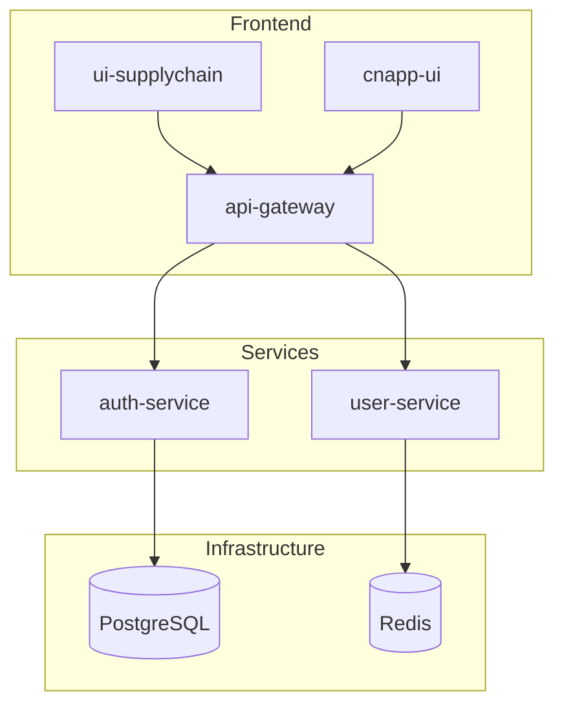

# Graph Generator

## What It Does

Generates a Mermaid architecture diagram showing how repos in a workspace depend on each other. Uses **zero AI tokens** — purely static file analysis of go.mod, package.json, Terraform, Docker Compose, and serverless configs.

**Note:** This feature is in beta. The graph is inferred from static files only — runtime connections (HTTP calls, message queues, Lambda invocations) cannot be detected. Users can edit the generated files to add known connections manually.

## Files Analyzed

| File | What It Reveals |
|------|----------------|
| `go.mod` | Go module dependencies, same-org imports |
| `package.json` | Node.js dependencies, workspace references |
| `*.tf` | Terraform resources (AWS, GCP, Azure) |
| `docker-compose.yml` | Docker services, databases, message queues |
| `serverless.yml` / `template.yaml` | Lambda functions, SQS, SNS, DynamoDB |

## How to Generate

When user asks for an architecture graph:

1. Identify the workspace using these methods (in order):
   - Check `.cursor/cc-context.json` for `"workspace"` field
   - Check the open `.code-workspace` filename (e.g., `platform.code-workspace` → workspace is `platform`)
   - Ask the user
2. Read the repo list from `contexts/[workspace].repos`
3. For each repo, scan for dependency files:

```bash
# For each repo path
find /repo/path -maxdepth 3 -name "go.mod" -o -name "package.json" -o -name "*.tf" -o -name "docker-compose.yml" -o -name "serverless.yml" -o -name "template.yaml" 2>/dev/null
```

4. Parse each file to extract dependencies:
   - **go.mod**: Look for `require` blocks, extract same-org imports
   - **package.json**: Check `dependencies` and `devDependencies` for workspace repos
   - **Terraform**: Identify cloud resources (aws_*, google_*, azurerm_*)
   - **Docker Compose**: Map services to databases, caches, queues
   - **Serverless**: Map Lambda functions to event sources

5. Generate a Mermaid diagram using `graph TB` (top-to-bottom). Group repos into subgraphs by category. Do **not** use `direction LR` inside subgraphs — Mermaid renders it poorly for complex graphs:



6. Save the Mermaid source to `docs/[workspace]/architecture.md`
7. Also generate an HTML file for browser viewing at `docs/[workspace]/architecture.html`:

If a previous HTML exists at `~/.command-center/docs/[workspace]/architecture.html`, use it as a template — replace only the Mermaid diagram and header text. Otherwise, generate a new HTML file with these features:
- **ELK layout engine** via ES module imports for better node placement
- **Hand-drawn look** (`look: handDrawn`) for modern visual style
- **Interactive pan & zoom**: scroll to zoom, click-drag to pan, +/− buttons, fit-to-screen button
- **Dark theme** with color-coded legend
- **Click-to-highlight**: clicking a node highlights its full upstream/downstream flow chain, dims everything else, and shows an info panel with connections
- **Frontmatter config** in the Mermaid code block for layout settings

Save as `docs/[workspace]/architecture.html`.

8. Open the HTML file in the browser: `open docs/[workspace]/architecture.html`

## Output Format

Save as a markdown file with a Mermaid code block at `docs/[workspace]/architecture.md`:

    # Architecture: [workspace]

    Generated: YYYY-MM-DD

    (mermaid graph TB block with the dependency diagram)

    ## Notes
    - Connections between repos are inferred from import paths and naming patterns
    - Runtime connections (like HTTP calls or Lambda invocations) cannot be detected statically
    - Users can edit the generated .md file to add known connections manually
